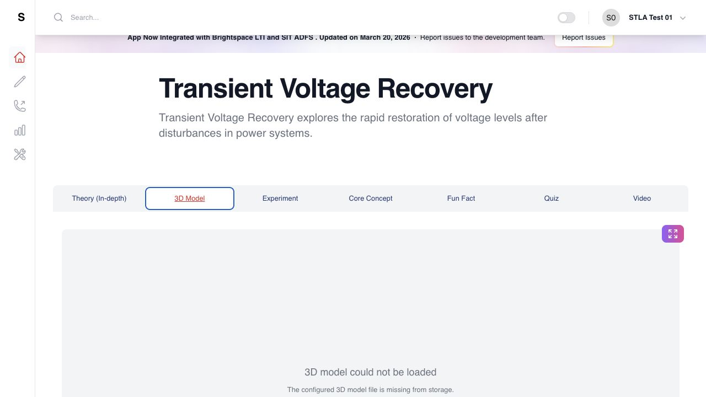
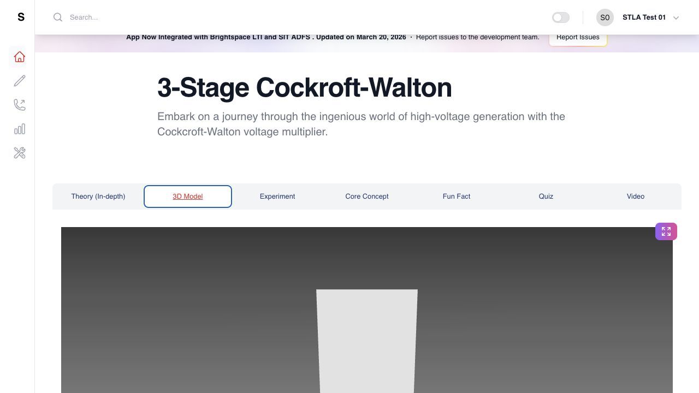
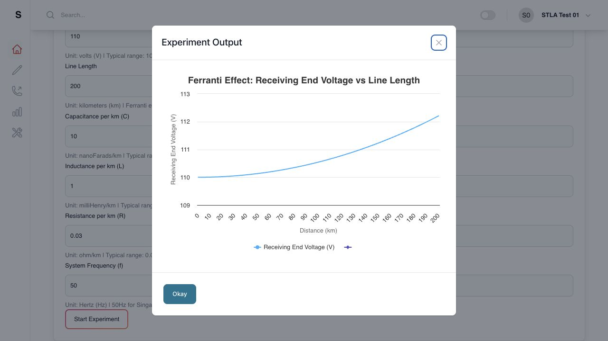
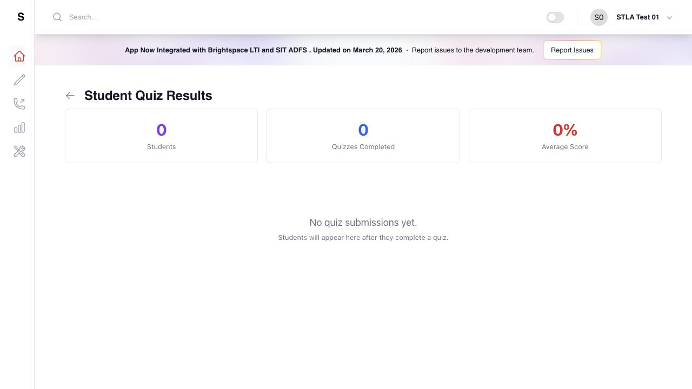
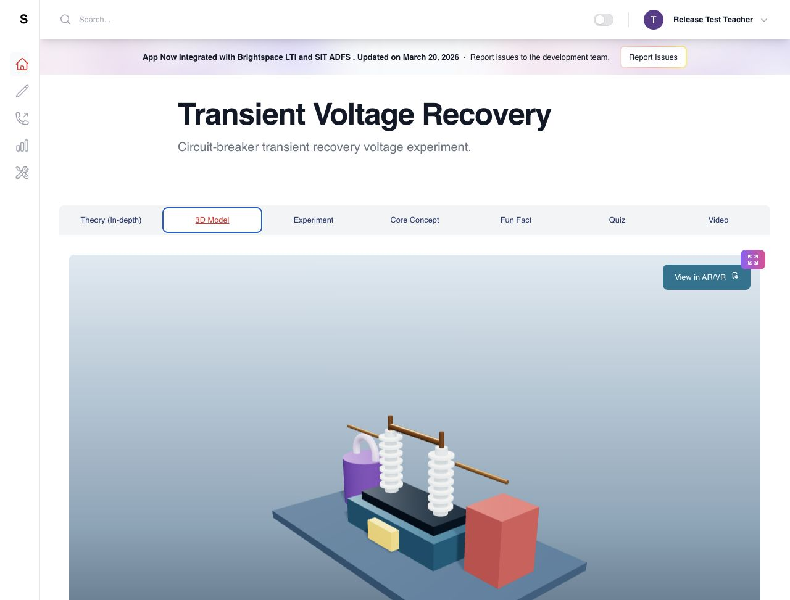
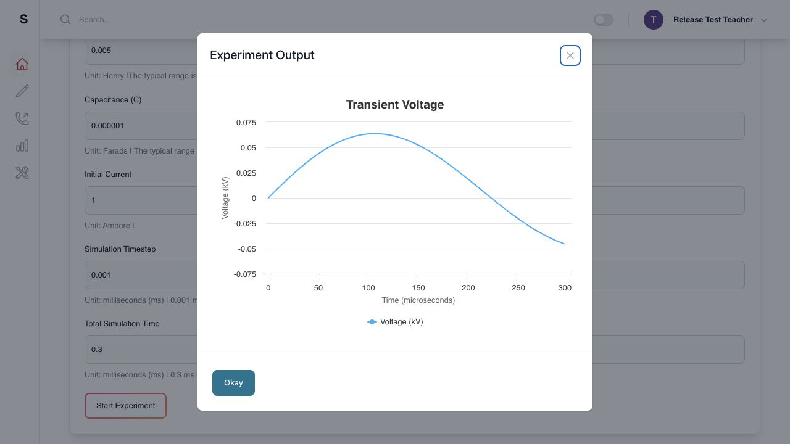
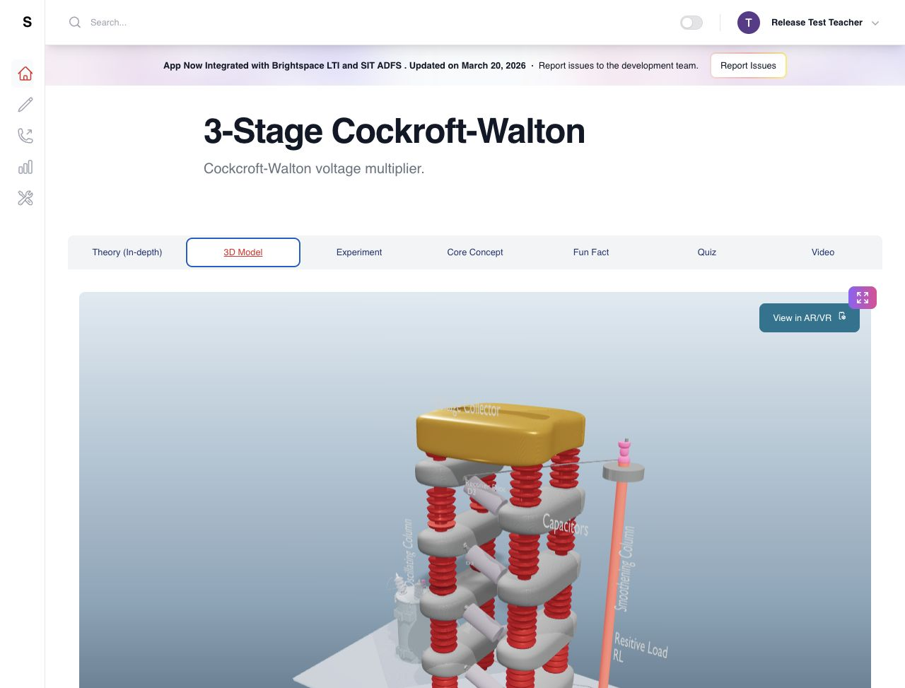
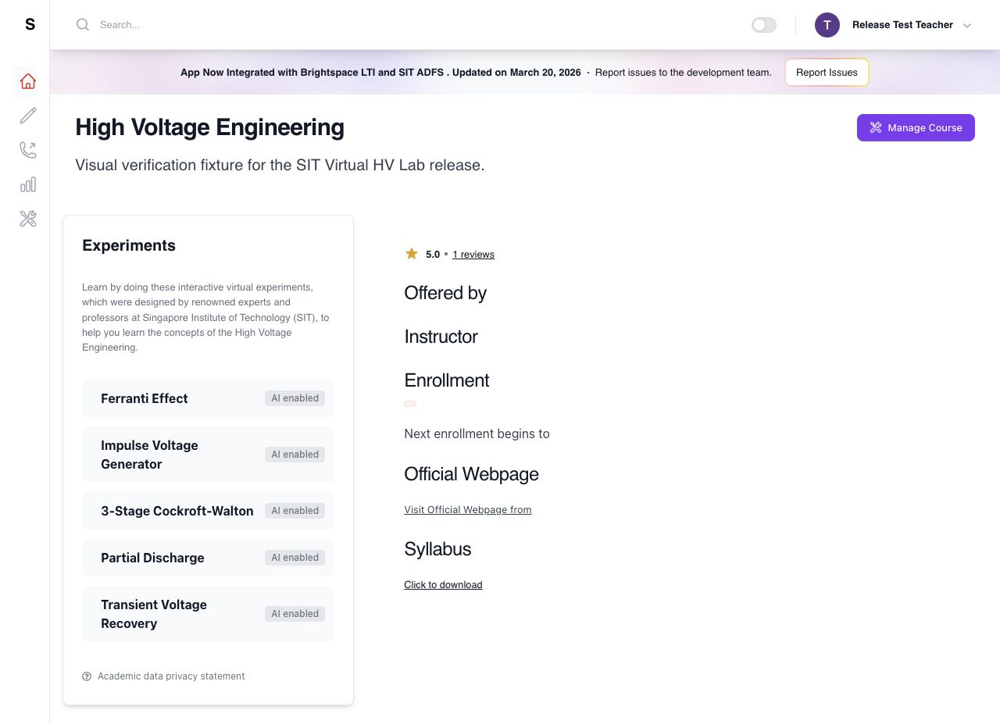
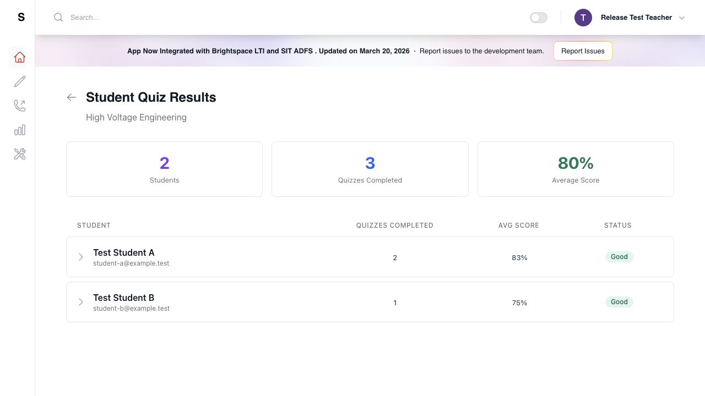

# SIT Virtual High Voltage Laboratory — Client Issues Test Report

**Report date:** 24 August 2026

**Production baseline inspected:** `origin/main` at `a92797d`

**Release branch:** `codex/sit-pending-issues-20260824`

**Implementation commit:** `e84b070`

**Merged `origin/main` commit:** `6800e19` via [GitHub PR #7](https://github.com/sayonsom/sit_test_v1/pull/7)

**Canonical production route:** <https://hvlabonline.singaporetech.edu.sg/>

**Source complaint:** Confluence page “Pending Issues”, page ID `10485834`

## Evidence boundary

The after-fix screenshots are release-candidate evidence captured against the real frontend in a local browser with a deterministic, synthetic API fixture. They contain no live student records or client credentials. They prove rendering, interaction, computation, and staff-results presentation for the merged code; they do **not** claim that the client has deployed that code. Separate privacy-safe screenshots document the authenticated production behavior before the client deployment.

## Defect and resolution matrix

| Jira | Client-reported situation | Root cause | Resolution | Candidate result |
| --- | --- | --- | --- | --- |
| [SIT-1](https://energyatlas.atlassian.net/browse/SIT-1) | Transient Voltage Recovery 3D model does not load and the simulation result is incorrect | Seed data referenced `highvoltage_trv.gltf`, but no such asset exists in the repository or its history. The former compute script also modelled the configured series RLC circuit with an incompatible expression and treated millisecond inputs inconsistently. | Added a bundled interactive circuit-breaker/TRV apparatus and a validated zero-input series-RLC capacitor-voltage response. Normalized the configured time inputs to milliseconds and plotted microseconds explicitly. | Pass |
| [SIT-2](https://energyatlas.atlassian.net/browse/SIT-2) | 3-stage Cockcroft–Walton 3D model is too dark | The GLB materials remained highly metallic/dark under a weak scene-lighting setup. | Added material-aware luminance lifting, reduced excessive metalness, brighter multi-source lighting, tone mapping, exposure control, a light gradient background, and contact shadows. | Pass |
| [SIT-3](https://energyatlas.atlassian.net/browse/SIT-3) | Experiments are blank or unusable | Every experiment depended on dynamically injecting a compute script with one shared DOM ID, while load and compute failures were swallowed into an indefinite spinner or empty panel. Several data-loading components also hid request failures. The client's blanket blank-state report was not reproduced in the bounded production path described below. | Bundled five pure calculators with the application, removed runtime compute-script injection, validated finite series, and added loading/error/retry states across experiment, theory, course, and module loading. | Pass — 5/5 local experiment forms |
| [SIT-4](https://energyatlas.atlassian.net/browse/SIT-4) | Teacher ADFS login cannot see submitted scores or averages | ADFS produced a `teacher` role, but the API only accepted a legacy seeded instructor email or administrator/service role for course results. The approved teacher therefore received no course scope. | Added an explicit `STAFF_COURSE_IDS` claim to the ADFS token and enforced that scope in API RBAC. The results screens now surface request failures and calculate course/student summaries from returned quiz records. | Pass with synthetic teacher/course fixture |

## Browser verification

| Scenario | Verification | Result |
| --- | --- | --- |
| TRV 3D apparatus | Open TRV, select **3D Model**, confirm the bundled breaker apparatus is visible and interactive with no missing-model error. | Pass |
| TRV simulation | Open **Experiment**, retain the documented defaults, select **Start Experiment**, confirm a finite damped response over `0–300 µs`. | Pass |
| Cockcroft–Walton visibility | Open the model under the light theme and confirm conductors, insulators, labels, multiplier stages, and platform are distinguishable. | Pass |
| All experiments | Open Ferranti Effect, Impulse Voltage Generator, 3-Stage Cockcroft–Walton, Partial Discharge, and Transient Voltage Recovery; select **Experiment** and confirm a populated form with **Start Experiment** and no visible load error. | Pass — 5/5 |
| Teacher results | Open the staff course-results route with a scoped synthetic teacher token; confirm summary cards, per-student averages, and individual quiz scores render. | Pass |

## Authenticated production reproduction before client deployment

The supplied SIT test-teacher account was entered only after explicit action-time authorization. No credential was logged, saved to the repository, copied into Jira, or included in a screenshot. The authenticated pass on 24 August 2026 established:

| Jira | Production observation on the pre-deployment bundle | Evidence result |
| --- | --- | --- |
| SIT-1 | The TRV 3D request returned `404`; the UI displayed “The configured 3D model file is missing from storage.” | Reproduced |
| SIT-2 | The Cockcroft–Walton scene used a near-black background and the apparatus geometry was not meaningfully distinguishable. | Reproduced |
| SIT-3 | Cockcroft–Walton and Ferranti experiment forms and output charts rendered during the tested authenticated navigation. The broad “all experiments blank” complaint was therefore not reproduced in this bounded pass. | Not reproduced; local 5/5 regression coverage retained |
| SIT-4 | ADFS sign-in and the course selector succeeded, but the student-results request returned `403`. The old UI swallowed the error and misleadingly displayed `0 Students`, `0 Quizzes Completed`, and `0% Average Score`. | Reproduced |

### SIT-1 — production before client deployment

### SIT-2 — production before client deployment

### SIT-3 — production reproduction boundary

### SIT-4 — production before client deployment

## Local release-candidate screenshots

### SIT-1 — TRV 3D apparatus

### SIT-1 — corrected TRV simulation

### SIT-2 — Cockcroft–Walton lighting

### SIT-3 — all five experiments available

### SIT-4 — teacher results and averages

## Automated release gates

| Gate | Command | Result |
| --- | --- | --- |
| Experiment regressions | `npm test` | Pass — 7/7 |
| Production frontend bundle | `npm run build` | Pass — 2,431 modules transformed |
| API security and RBAC | Run `unittest` discovery under `backend-api/tests` | Pass — 8/8 |
| LTI/OIDC configuration and security | Run `unittest` discovery under `backend-lti/tests` in an isolated Python 3.11 environment | Pass — 15/15 |
| Python syntax/import compilation | `python3.11 -m compileall -q backend-api/app backend-lti/app` | Pass |
| XSS policy regression | `npm run security:verify-xss` | Pass |
| Dependency audit | `npm audit --audit-level=high` | Pass — 0 vulnerabilities |
| UAT compose rendering | `docker compose --env-file .env.uat.example -f docker-compose.uat.yml config --quiet` | Pass |
| Patch integrity | `git diff --check` | Pass |

The production build reports its existing large-bundle advisory (main JavaScript bundle above 500 kB). It is non-blocking for these fixes and should be handled as a separate performance task.

## Client deployment handoff

**Implementation status:** Complete and pushed to GitHub.

**Client deployment status:** Pending; the client owns deployment to the SIT server.

After the client deploys merged commit `6800e19`, the following checks should be rerun on the canonical route:

1. Public root and `/health` return successfully.
2. ADFS teacher sign-in completes using the authorized test account.
3. Teacher can open course results and see submitted scores and calculated averages without a 403 or blank state.
4. All five experiment forms render on production.
5. TRV apparatus and corrected default simulation render on production.
6. Cockcroft–Walton is readable under the production light theme.
7. Browser console and relevant network requests contain no fatal error for the tested flows.

Deployment time, image/container identity, and post-deployment live screenshots cannot be asserted until the client deploys the merged commit.
